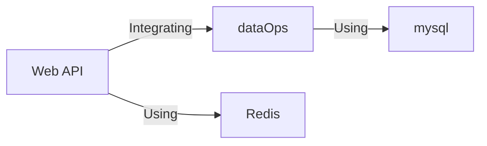
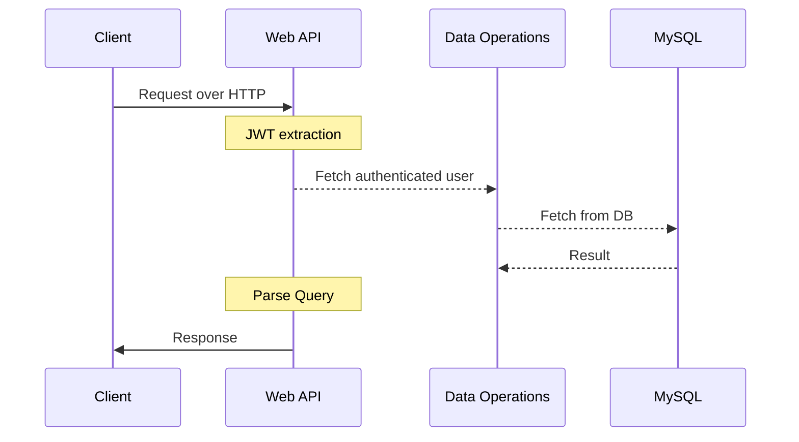
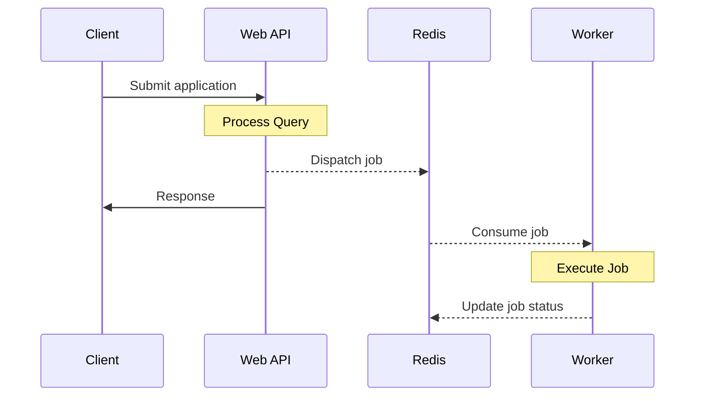

# Architecture Overview

The purpose of this section is to briefly introduce an overview for the backend ;
to highlight the key actors/services.

## Summary

> As we speak, we do not have data operations layer yet

The main dependencies can be displayed as the following :

-   The Web API is based on NodeJS and running Sequelize ORM.
-   The data operations require connections to one (or many) MySQL instances.

## Web API request flow

The simplest query could be described with the following flow :

Whenever there is a `Authorization` header provide the JWT Token, this token will 
be parse and the user entity will be fetched from the database.
The web API does not have the capability to directly executes operations onto the database.
All operations (both read and write) are implemented in a package called `data-operations`.

## Asynchronous jobs

Asynchronous jobs are executed and organized by bulljs over redis as message broaker.

We can summarize the flow as the following :

